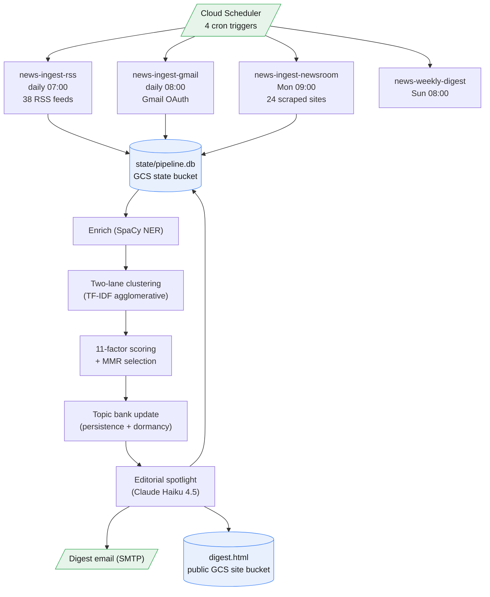

# news-sum

news-sum exists because keeping up with media-industry news by hand does not scale: dozens of feeds, newsletters, and newsrooms all publish the same handful of stories in different words, and a human reader wants the recurring ones surfaced, not buried under daily noise. The job ingests RSS feeds, Gmail newsletters, and scraped corporate newsrooms, clusters and dedups the results, scores them on eleven normalised signals that reward discourse coverage over a single reading window (not trending novelty or click-through), and emails a weekly digest while publishing the same content as a static page. A persistent topic bank tracks how long each story has been running so week-three coverage reads as "third consecutive week" rather than a fresh item, and a logistic regressor nudges the scoring weights once enough history accumulates.

## Data flow



## Layout

```
common.py           schema, USER_PROFILE, SOURCE_PRIORS, FEEDS
digest.py           pipeline: enrich, cluster, score, spotlight, render
evaluate.py         coverage ledger and adaptive weight tuning
ingest_rss.py       RSS ingestion (38 feeds)
ingest_gmail.py     Gmail newsletter ingestion (OAuth)
ingest_newsroom.py  corporate newsroom scraper (24 sites)
metrics_email.py    internal metrics email
export_db.py        downloads and exports the SQLite DB
Dockerfile          single image, entrypoint chosen by JOB env var
deploy.sh           one-shot standalone deploy script
gcloud_app.yaml     manifest read by the shared ../manage.py orchestrator
```

## Setup

```bash
gcloud auth login
gcloud projects create YOUR_PROJECT --name="News Digest"
gcloud config set project YOUR_PROJECT
```

Create the two buckets (state private, site public) and the required secrets, then deploy:

```bash
gcloud storage buckets create gs://YOUR_PROJECT-news-state --location=europe-west1
gcloud storage buckets create gs://YOUR_PROJECT-news-site --location=europe-west1
gcloud storage buckets add-iam-policy-binding gs://YOUR_PROJECT-news-site \
  --member=allUsers --role=roles/storage.objectViewer

printf "sk-ant-..." > tmp && gcloud secrets create news-anthropic-key --data-file=tmp && rm tmp
printf "app-password" > tmp && gcloud secrets create news-smtp-pass --data-file=tmp && rm tmp
# Gmail OAuth is optional; skip to disable Gmail ingest
gcloud secrets create news-gmail-oauth-token --data-file=token.json

bash deploy.sh   # edit PROJECT, REGION, SMTP_USER, DIGEST_TO at the top first
```

The Gmail OAuth token is produced once with a short local script using `InstalledAppFlow` from `google_auth_oauthlib`, scoped to `gmail.readonly`, then dumped to `token.json` and uploaded as the secret above.

Verify with:

```bash
gcloud run jobs execute news-ingest-rss --region=europe-west1 --wait
```

## Commands

| Action | Command |
|---|---|
| Deploy or update all four jobs | `bash deploy.sh` |
| Deploy via the shared orchestrator | `python ../manage.py` |
| Rebuild the image only | `gcloud builds submit --tag europe-west1-docker.pkg.dev/YOUR_PROJECT/news/app:latest .` |
| Update one job to the latest image | `gcloud run jobs update news-weekly-digest --image=europe-west1-docker.pkg.dev/YOUR_PROJECT/news/app:latest --region=europe-west1` |
| Trigger a job manually | `gcloud run jobs execute news-weekly-digest --region=europe-west1 --wait` |
| Tail logs for a job | `gcloud logging read "resource.type=cloud_run_job AND resource.labels.job_name=news-weekly-digest" --limit=50 --format="table(timestamp, textPayload)"` |
| Download and export the SQLite DB | `python export_db.py --bucket YOUR_PROJECT-news-state --csv articles.csv --json articles.json` |
| Force-clear a stuck lock | `gcloud storage rm gs://YOUR_PROJECT-news-state/state/pipeline.lock` |

## Operations

**Redeploy after a code change** runs the same `bash deploy.sh`, or the two-command rebuild-then-update sequence above for a single job.

**Customising the pipeline.** `USER_PROFILE` (a BM25 relevance query), `KEY_ENTITIES` (entities that get a 2x signal boost), `SOURCE_PRIORS` (all 1.0 by default, letting persistence learn source quality), and `FEEDS` all live in `common.py`. `DEFAULT_WEIGHTS` (the eleven score-term weights) and `RELEVANCE_FLOOR` are at the top of `digest.py`.

**Common failures.**

- Lock not released: `pipeline.lock` auto-evicts after 30 minutes; force-clear it with the command above if a run needs to proceed sooner.
- "Too few items" on the first digest: ingest needs several runs to accumulate content; re-execute the three ingest jobs, then re-run the digest.
- Digest email not received: `SMTP_PASS` must be the 16-character Gmail App Password with no spaces, on an account with 2FA enabled.
- Static page returns 403: re-run the public IAM grant from Setup on the site bucket.
- SpaCy model missing: the image build downloads `en_core_web_sm`; if the error fires, rebuild the image.

## Cost

Pricing assumes no free-tier credits. Cloud Run: $0.000024/vCPU-s, $0.0000025/GiB-s. Claude Haiku 4.5: $0.80/MTok in, $4.00/MTok out.

| Resource | Schedule | Runtime | Monthly |
|---|---|---|---|
| ingest-rss | daily 07:00 | ~3 min x 1 vCPU / 1 GiB | $0.14 |
| ingest-gmail | daily 08:00 | ~2 min x 1 vCPU / 1 GiB | $0.10 |
| ingest-newsroom | weekly Mon | ~10 min x 1 vCPU / 1 GiB | $0.06 |
| weekly-digest | weekly Sun | ~20 min x 2 vCPU / 2 GiB | $0.25 |
| Cloud Scheduler (4 jobs) | | | $0.40 |
| Artifact Registry (~1 GB) | | | $0.10 |
| Cloud Build (on deploy) | | | $0.02 |
| Cloud Storage (DB + HTML, ~15 MB) | | | $0.01 |
| Claude Haiku (digest + macro), 4-5 runs, ~20K in / 1.5K out | | | $0.06 |
| **Total** | | | **~$1.14/month** |

> Estimates only, verify current pricing in the Google Cloud and Anthropic consoles before relying on them.

Cost controls: jobs scale to zero between runs, RSS ingestion uses HTTP caching (ETag/Last-Modified) to skip unchanged feeds, MMR caps the LLM's input at the score-knee regardless of corpus size, and newsroom scraping runs weekly with a polite crawl delay.
